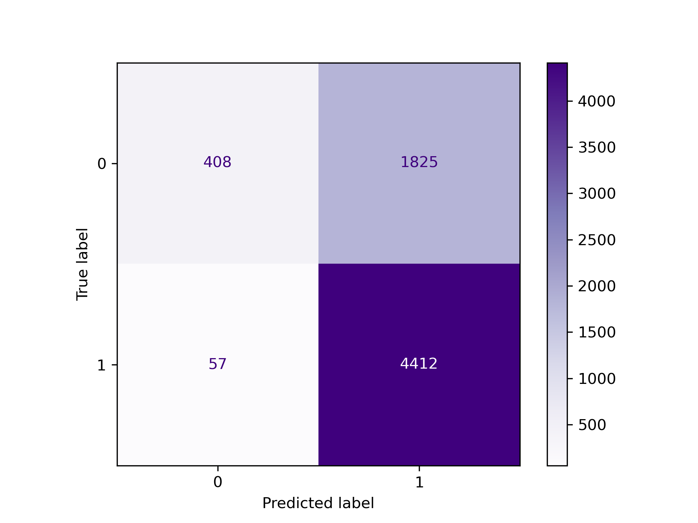

# Marketing Insights from Twitter Sentiment

Zenith Mobile is an innovative startup poised to disrupt the mobile technology landscape by offering groundbreaking solutions that challenge the dominance of established brands. Instead of relying on traditional marketing avenues, Zenith Mobile's strategy is digital-first: identify potential customers active on social media, particularly those who feel lackluster about leading brands, and reach out to them directly. By doing this, they aim to create a direct dialogue with potential customers and showcase the unique advantages that Zenith Mobile has to offer.

To bring this strategy to life, we modeled sentiments from tweets related to big names in mobile tech, such as Apple and Google. We specifically worked with a compilation of 9,093 tweets about Apple or Google products. The tweets have been categorized based on sentiment: 2,978 are positive, 570 are negative, 5,389 are neutral, and 156 couldn't be determined. Since the goal is to pinpoint individuals who might be feeling indifferent or unsatisfied with the dominant brands, the positive class (labeled 1) was grouped to consist of all the neutral and negative sentiment tweets, for a total of 5,959 1s in the dataset. The negative class (labeled 0) consisted of all the positive sentiment tweets, for a total of 2,978 zeros.¶

We modeled the emotionality of the tweets using Natural Language Processing (NLP) in combination with several classifiers: Multinomial Naive Bayes, Logistic Regression, Random Forest, Neural Network, XGBoost, and Complement Naive Bayes. In running and tuning these models, we optimized for high recall scores to ensure that Zenith Mobile identifies as many likely potential customers as possible, minimizing the chances of missing out on someone who might be interested in their products.

After running baseline models for all the classifiers selected, Complement Naive Bayes, XGBoost, Random Forest, and Logistic Regression showed promise and were selected for further hyperparameter tuning. Following hyperparameter tuning, Complement Naive Bayes outperformed all other models with training, validation, and testing recall scores of 0.99, 0.98, and 0.98, respectively.

## Dataset & Methods
The data used in this study were sourced by CrowdFlower and are available on [DataWorld](http://data.world). 





## Preparation for Modeling
## Baseline Model Comparison
## Hyperparameter Tuning 
## Conclusions


## Repository Structure
```none            
├── data 
├── figs                   
├── .gitignore
├── README.md 
├── gameplay-classification.ipynb
└── brainboost-gameplay-classification.pdf
