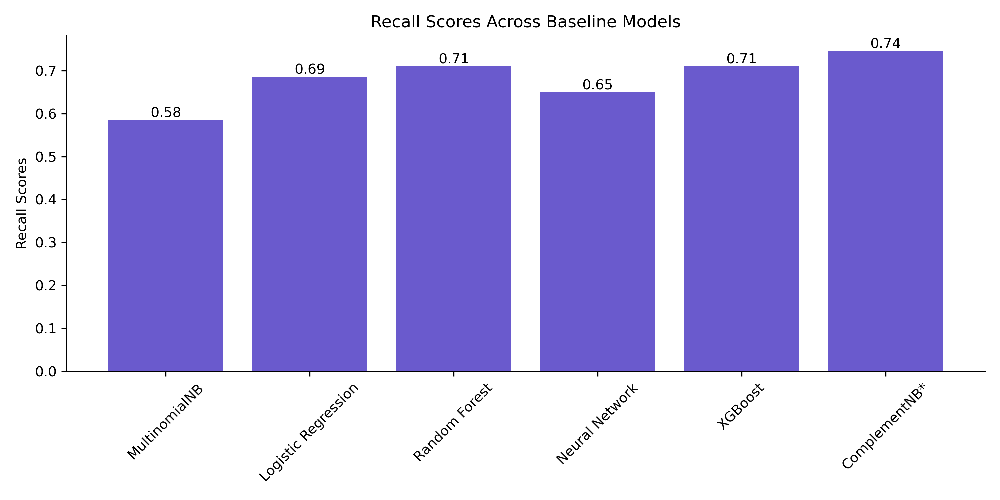
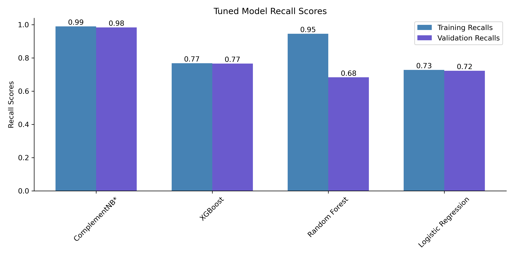

# Marketing Insights from Twitter Sentiment

Zenith Mobile is an innovative startup poised to disrupt the mobile technology landscape by offering groundbreaking solutions that challenge the dominance of established brands. Instead of relying on traditional marketing avenues, Zenith Mobile's strategy is digital-first: identify potential customers active on social media, particularly those who feel lackluster about leading brands, and reach out to them directly. By doing this, they aim to create a direct dialogue with potential customers and showcase the unique advantages that Zenith Mobile has to offer.

To bring this strategy to life, I modeled sentiments from tweets related to big names in mobile tech, such as Apple and Google. I specifically worked with a compilation of 9,093 tweets about Apple or Google products. The tweets have been categorized based on sentiment: 2,978 are positive, 570 are negative, 5,389 are neutral, and 156 couldn't be determined. Since the goal is to pinpoint individuals who might be feeling indifferent or unsatisfied with the dominant brands, the positive class (labeled 1) was grouped to consist of all the neutral and negative sentiment tweets, for a total of 5,959 1's in the dataset. The negative class (labeled 0) consisted of all the positive sentiment tweets, for a total of 2,978 0's.

I modeled the emotionality of the tweets using Natural Language Processing (NLP) in combination with several classifiers: Multinomial Naive Bayes, Logistic Regression, Random Forest, Neural Network, XGBoost, and Complement Naive Bayes. I optimized for high recall scores to ensure that Zenith Mobile identifies as many likely potential customers as possible, minimizing the chances of missing out on someone who might be interested in their products.

After running baseline models for all the classifiers selected, Complement Naive Bayes, XGBoost, Random Forest, and Logistic Regression showed promise and were selected for further hyperparameter tuning. Following hyperparameter tuning, Complement Naive Bayes outperformed all other models with training, validation, and testing recall scores of 0.99, 0.98, and 0.98, respectively.

## Dataset & Methods
The data used in this study were sourced by CrowdFlower and are available on [DataWorld](http://data.world). 

## Preparation for Modeling
Tweets were case normalized, tokenized, part-of-speech tagged, lemmatized, and vectorized for cleaning and preprocessing.

## Baseline Model Comparison
Preprocessed data were fed into 6 baseline models: 
- Multinomial Naive Bayes
- Logistic Regression
- Random Forest
- Neural Network
- XGBoost
- Complement Naive Bayes
  
*Note that I fed the resampled dataset to the majority of these models (Multinomial Naive Bayes, Logistic Regression, Random Forest, Neural Network, and XGBoost) but fed the entire dataset to Complement Naive Bayes, since it is robust to imbalanced data.

Baseline model performance was assessed using recall scores and were as follows: 


Of all the baseline models, Complement Naive Bayes performs the best with a recall score of 0.74. XGBoost, Random Forest, and Logistic Regression also perform reasonably well, with recall scores of 0.71, 0.71, and 0.69, respectively. For this reason, I continued on to hyperparameter tune these top 4 performing models.

## Hyperparameter Tuning
Following hyperparameter tuning, recall scores for the top 4 performing models were as follows: 


The tuned Complement Naive Bayes classifier performs exceptionally well, with training and validation recall scores approaching 1. The tuned Random Forest also performs well during training, but appears to be overfitting, as evidenced by the discrepancy between training and validation scores (recall = 0.95 for training, recall = 0.68 for testing). The tuned XGBoost and Logistic Regression classifiers do not perform much better than their baseline models. For these reasons, I selected the Complement Naive Bayes classifier as the final model. To confirm this model selection, I passed unseen data (the test set) to the Complement Naive Bayes classifier and found a similarly high recall score of 0.98.

## Conclusions:
- We are able to successfully classify tweets based on emotionality with high model performance scores.
- A Complement Naive Bayes classifier outperforms all other models tested, and gives the added benefit of managing the entire, imbalanced dataset.
- The final model achieves high recall (0.98), although sacrifices precision (0.69).


## Repository Structure
```none            
├── data 
├── figs                   
├── .gitignore
├── README.md 
├── zenith-twitter-sentiment-analysisipynb
└── zenith-twitter-sentiment-analysis.pdf
